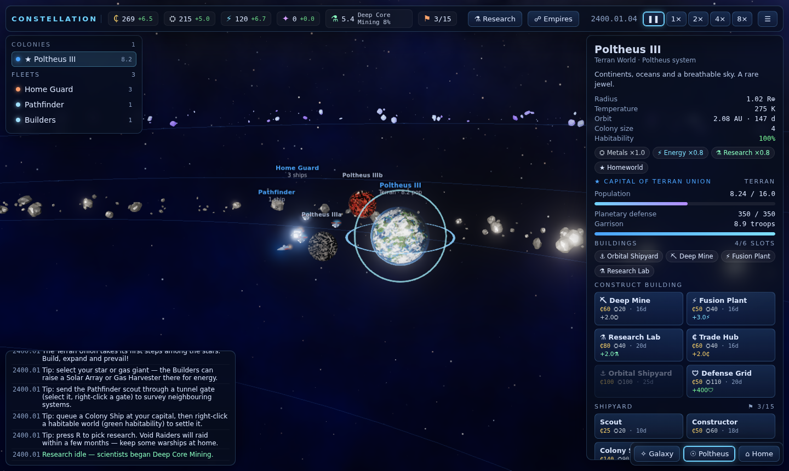
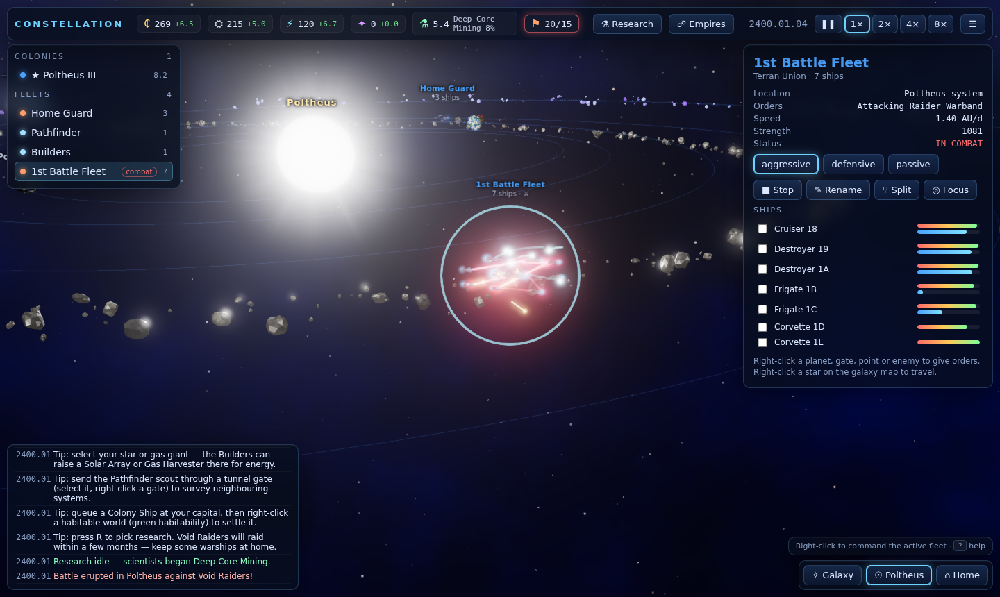
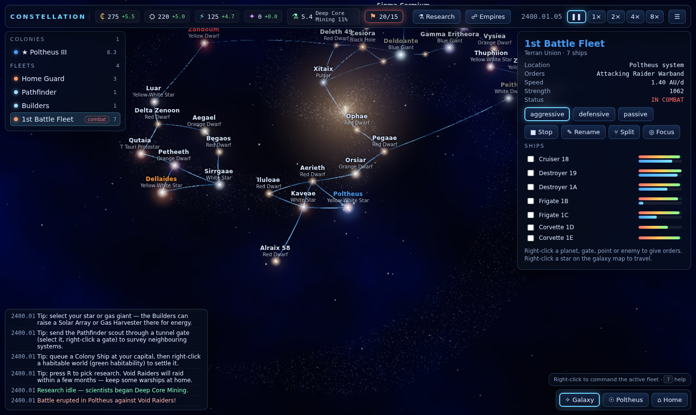
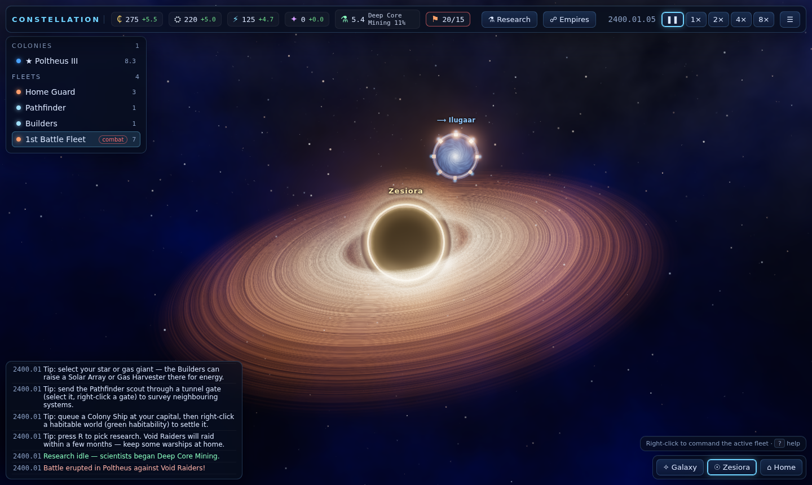

# Constellation v3

A real-time 3D grand strategy game of stars, tunnels, fleets and empires, running entirely in the browser.

Pick a species, grow your homeworld into an interstellar power, and chart a galaxy of procedurally generated star systems linked by ancient tunnels. You win by **Conquest**, by **Hegemony** (control 60% of all systems), or by completing the **Ascension Project**. Rival AI empires and the Void Raiders pirates are chasing the same goals.



| Fleet battle | Galaxy map | Black hole |
| --- | --- | --- |
|  |  |  |

## Quick start

```bash
cd v3
npm install
npm run dev          # http://localhost:5173
```

| Command | What it does |
| --- | --- |
| `npm run dev` | Start the Vite dev server |
| `npm run build` | Typecheck and build a static bundle into `dist/` (host it anywhere) |
| `npm test` | Run the simulation unit tests (Vitest) |
| `npm run test:e2e` | Run the browser end-to-end tests (Playwright + Chromium) |
| `npm run typecheck` | Run a strict TypeScript check |

## What's new compared to v2

| | v2 | v3 |
| --- | --- | --- |
| Graphics | Flat shading, no post-processing | HDR bloom and ACES tone mapping. Per-pixel procedural planets with clouds, atmospheres, city lights, lava cracks and gas bands. Animated star photospheres and coronas. Environment-lit metal hulls. |
| Stars | M–O main sequence, giants | 13 types: red/orange/yellow dwarfs, F and A stars, blue giants and supergiants, red giants, white and brown dwarfs, **pulsars** with sweeping beams, **black holes** with accretion disks, **T Tauri protostars** in dusty nebulae. Also binaries. |
| Planets | 13 types | 16 types (terran, ocean, jungle, savanna, desert, tundra, arctic, toxic, lava, barren, rust, crystalline, ice dwarf, gas giant, hot Jupiter, ice giant). Also moons (including habitable ones), ring systems, comets with tails, and 5 asteroid belt types. |
| Ships | A single unused ship record; combat was a dice roll | 10 procedural hard-sci-fi hulls with radiators, trusses, tanks and engine bells. You build them at shipyards, group them into fleets, and order them around a system or through tunnels. |
| Combat | Instant server-side roll | Real-time battles when hostile fleets meet. Lasers, railguns, missiles, point defence and particle lances each have strengths against shields and armour. Also planetary sieges and troop invasions. |
| Economy | Energy "pool" with no real income, and a colony-output cliff at 100M pop | Four stockpiles plus research, all as real per-day flows with upkeep. Buildings need workers. Automated orbital stations. Administration costs curb sprawl. Fleet command capacity. 42-tech research tree. Megastructures. |
| Opponents | Other human players only | Utility AI empires with personalities that expand, research, go to war and make peace. Void Raiders get stronger over time and raid weak colonies. |

## How to play

The in-game **How to play** screen (`?`) is the reference. Controls:

| Input | Action |
| --- | --- |
| Left-click | Select a planet, star, fleet, gate or system |
| Right-click | Order the active fleet: move, colonize, invade, attack, jump through a gate or travel to a system |
| Left-drag / right-drag / WASD | Rotate / pan the camera |
| Wheel | Zoom |
| Double-click | Focus the object / enter the system |
| `Space`, `1`–`4` | Pause, game speed |
| `G` / `H` | Galaxy map / home system |
| `R` / `E` | Research tree / empires and diplomacy |
| `F` / `Esc` | Focus the selection / deselect or open the menu |

The game autosaves to `localStorage` every 90 seconds, and you can save manually from the menu.

## Architecture

```
v3/src
├── sim/        Pure, deterministic simulation (no DOM, no WebGL)
│   ├── data/   Star, planet, belt, ship, weapon, building, station, tech and species tables
│   ├── galaxy.ts     Spiral galaxy layout, Gabriel-graph tunnel network, system generation
│   ├── economy.ts    Habitability, population, production, upkeep, queues, research
│   ├── fleets.ts     Movement, Dijkstra routing, colonize/build/invade actions
│   ├── combat.ts     Engagement detection, weapon fire, damage model, sieges, repair
│   ├── ai.ts         Rival empire AI;  pirates.ts: Void Raiders
│   ├── commands.ts   Validated commands (shared by player UI and AI)
│   └── game.ts       Fixed-step loop (0.1 day), victory, save/load
├── render/     Three.js views, procedural shaders, ship/station models, effects
└── ui/         HUD, lobby, labels (plain DOM + CSS)
```

The whole game state is plain JSON with a seeded RNG, so saves are trivial and replays are deterministic. The simulation has no browser dependencies. It runs unchanged in Node, which is how the tests (and a future authoritative multiplayer server) use it.

## Testing

- **Unit tests** (`tests/sim.test.ts`) cover:
  - Generation: determinism, a connected tunnel network, homeworld fairness, and stellar/planetary variety.
  - Orbital mechanics.
  - The economy.
  - Research.
  - Fleet routing, colonisation, station building, and split/merge.
  - Combat, pirate bounties, sieges and invasions.
  - Save/load determinism.
  - Victory and defeat.
  - A 1,500-day, 6-empire AI marathon that checks state invariants.
- **End-to-end tests** (`e2e/game.spec.ts`) drive the real UI in Chromium:
  - The title screen and the 3D render.
  - Building from the colony panel.
  - Right-click fleet orders and galaxy travel.
  - The research tree.
  - A live battle with weapon effects.
  - Save, reload and continue.
  - Diplomacy.

  Every test also fails on any console error.
